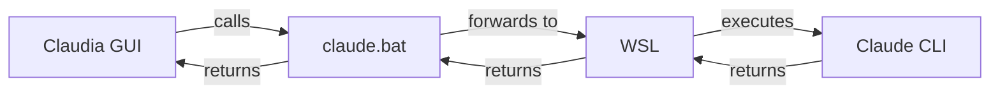

# Claudia For Windows

A comprehensive Windows compatibility solution for [Claudia GUI](https://github.com/getAsterisk/claudia) using WSL (Windows Subsystem for Linux) as a bridge.


## 🎯 Overview

This repository provides a complete solution to run Claudia (a GUI for Claude) on Windows by:
- Installing Claude CLI in WSL where it works natively
- Creating a Windows bridge script (`claude.bat`) that Claudia can communicate with
- Automatically detecting and adapting to different Claude CLI versions
- Providing pre-flight checks to ensure everything is configured correctly
- Handling Windows-specific build issues and icon problems

## 📋 Prerequisites

Before starting, ensure you have:

| Component | Description | Installation | Notes |
|-----------|-------------|--------------|-------|
| **Windows 10/11** | With latest updates | Windows Update | |
| **WSL 2** | Windows Subsystem for Linux | `wsl --install` in Admin PowerShell | May already be installed |
| **Ubuntu** | Linux distribution for WSL | Microsoft Store | Default WSL distro |
| **Node.js 18+** | Required in WSL for Claude Code | Install via NodeSource in WSL | NOT Windows Node.js |
| **Bun** | JavaScript runtime (Windows) | [bun.sh](https://bun.sh/) | Install in Windows, not WSL |
| **Rust** | For building Tauri | [rustup.rs](https://rustup.rs/) | Install in Windows |
| **VS Build Tools** | C++ compiler | [Download](https://visualstudio.microsoft.com/visual-cpp-build-tools/) | Select "Desktop development with C++" |
| **Claudia** | The app source code | Clone from GitHub | |
| **RAM** | Minimum 4GB recommended | System requirement | |

## 🚀 Quick Installation

```cmd
# 1. Clone Claudia
git clone https://github.com/getAsterisk/claudia.git
cd claudia

# 2. Clone this repository
git clone https://github.com/Kirchlive/Claudia-For-Windows.git

# 3. Run the auto-installer
Claudia-For-Windows\auto-install-windows.bat

# 4. When prompted, press 'y' to continue with setup

# 5. Build Claudia (in Windows CMD)
bun install
bun run build
bun run tauri build

# 6. Launch with
start-claudia.bat
```

## 📖 Detailed Installation Guide

### Step 1: Install WSL and Ubuntu

1. **Open PowerShell as Administrator**
   ```powershell
   wsl --install
   ```

2. **Restart your computer**

3. **Set up Ubuntu** - Create username and password when prompted

### Step 2: Install Node.js in WSL

> ⚠️ **Important:** Claude Code does NOT run directly on Windows. It must be installed inside WSL.

1. **Open Ubuntu/WSL Terminal**

2. **Install Node.js 20+ via NodeSource** (Recommended)
   ```bash
   # Update package list
   sudo apt update
   
   # Install curl if not present
   sudo apt install -y curl
   
   # Add NodeSource repository for Node.js 20.x
   curl -fsSL https://deb.nodesource.com/setup_20.x | sudo -E bash -
   
   # Install Node.js
   sudo apt install -y nodejs
   
   # Verify installation (should show v20.x or higher)
   node --version
   npm --version
   ```

3. **Configure npm for Linux**
   ```bash
   # Ensure npm uses Linux paths, not Windows
   npm config set prefix ~/.npm-global
   npm config set os linux
   
   # Add npm global bin to PATH
   echo 'export PATH="$HOME/.npm-global/bin:$PATH"' >> ~/.bashrc
   source ~/.bashrc
   ```

4. **Install Claude Code**
   ```bash
   # Install Claude Code globally
   npm install -g @anthropic-ai/claude-code
   
   # Verify installation
   claude --version
   ```

### Step 3: Install Windows Prerequisites

1. **Install Bun** (in Windows, NOT WSL)
   - Visit [https://bun.sh/](https://bun.sh/)
   - Run the PowerShell command
   - Verify: `bun --version`

2. **Install Rust** (in Windows, NOT WSL)
   - Visit [https://rustup.rs/](https://rustup.rs/)
   - Run the installer
   - Verify: `rustc --version`

3. **Install Visual Studio Build Tools**
   - Download from [Microsoft](https://visualstudio.microsoft.com/visual-cpp-build-tools/)
   - Select "Desktop development with C++"
   - Install and restart if needed

## 🔧 How It Works



**Key Components:**

1. **Claude CLI** - Runs natively in WSL/Linux environment
2. **claude.bat** - Windows bridge script that:
   - Detects Claude CLI version automatically
   - Filters incompatible Windows arguments
   - Handles proper command escaping
3. **Patched main.rs** - Accepts multiple Claude versions
4. **start-claudia.bat** - Pre-flight checker and launcher

## 📁 Repository Contents

- **`claudia-windows-fix.md`** - Complete installation guide with troubleshooting
- **`claude_binary_patch.rs`** - Version compatibility patch reference
- **`setup-windows.bat`** - WSL bridge setup script
- **`start-claudia.bat`** - Pre-flight checker and launcher
- **`auto-install-windows.bat`** - Fully automated installer

## 🐛 Troubleshooting

### Common Issues and Solutions

| Error | Cause | Solution |
|-------|-------|----------|
| `claude: command not found` | CLI not installed in WSL | Run `setup-windows.bat` again |
| `claude.bat is not recognized` | PATH not configured | Add `C:\Users\USERNAME\AppData\Roaming\npm` to system PATH |
| `Failed to load settings` | Missing ~/.claude directory | Run setup script or `wsl mkdir -p ~/.claude` |
| `Version mismatch` | Old patch version | Ensure you applied v4.2 patch |
| `Wrong WSL distribution` | Multiple WSL installs | Edit claude.bat, set `WSL_DISTRO=Ubuntu` |
| `icon.ico not in 3.00 format` | Invalid icon format | Use provided icons or regenerate |
| `cp command not found` | Unix commands in Windows | Apply build script patches |
| `ENOENT: spawn bun` | Missing shell option | Apply build-executables.js patch |
| `Couldn't find a .ico icon` | Missing icon in config | Add icon.ico to tauri.conf.json |
| `pkg-config not found` | Building in WSL instead of Windows | Build in Windows CMD, not WSL |
| `Projects directory not found` | Missing ~/.claude/projects folder | Fixed in v4.2 by changing error to debug log |

### Build Location Issues

**NEVER run build commands in WSL!** Common mistakes:
- ❌ Running `cargo build` in WSL terminal
- ❌ Running `bun run build` in WSL terminal
- ✅ Always use Windows CMD or PowerShell
- ✅ The start-claudia.bat script runs in the correct environment

### Verify Installation

Run these commands to verify your setup:

```cmd
# Check WSL
wsl --status

# Check Claude in WSL
wsl bash -lc "~/.npm-global/bin/claude --version"

# Check bridge
claude --version

# Check Bun
bun --version

# Check Rust
rustc --version
```

### Manual PATH Configuration

If `claude.bat` is not found:

1. Press `Win + X` → System → Advanced system settings
2. Click "Environment Variables"
3. Under "User variables", select "Path" and click "Edit"
4. Add new entry: `C:\Users\USERNAME\AppData\Roaming\npm`
5. Click OK and restart Command Prompt

## 🆕 What's New in v4.2

| Feature | v4.1 | v4.2 |
|---------|------|------|
| Build Script Patches | Manual application | Fully automated with auto-install-windows.bat |
| Icon Handling | Basic | Comprehensive troubleshooting |
| Build Location | Unclear | Explicit Windows CMD requirement |
| Error Documentation | Basic | Extensive with solutions |
| Pre-installation Checks | None | Check existing installations |
| Script Modifications | Main.rs only | All patches automated |

### Key Improvements:
- Added Windows-specific build script patches
- Clear warnings about build location (Windows vs WSL)
- Comprehensive icon error handling
- Robocopy exit code handling
- Shell spawn fixes for Windows
- Better error messages and solutions
- "Projects directory not found" error suppression

## 📝 Notes

- **Development Mode**: The start script runs Claudia in dev mode by default
- **Production Build**: For production, use `bun run tauri build` instead
- **Updates**: When updating Claudia, you may need to reapply patches
- **Multiple WSL**: If you have multiple distributions, edit claude.bat to specify which one
- **Build Environment**: ALWAYS build in Windows CMD/PowerShell, NEVER in WSL

## 🤝 Contributing

Found an issue or improvement? Please:
1. Test the fix thoroughly
2. Document any new issues
3. Submit a pull request or open an issue

## 📜 License

This project is licensed under the MIT License - see the [LICENSE](LICENSE) file for details.

## 🙏 Credits

This fix was developed collaboratively by the Claudia community. Special thanks to all testers and contributors who helped refine this solution for Windows users.

**Version:** 4.2  
**Last Updated:** January 2025  
**Compatibility:** Windows 10/11, WSL2, Claudia 0.1.0+

## 📚 Additional Resources

- [Claudia Repository](https://github.com/getAsterisk/claudia)
- [Detailed Installation Guide](claudia-windows-fix.md)
- [WSL Documentation](https://docs.microsoft.com/en-us/windows/wsl/)
- [Node.js in WSL Guide](https://docs.microsoft.com/en-us/windows/dev-environment/javascript/nodejs-on-wsl)
