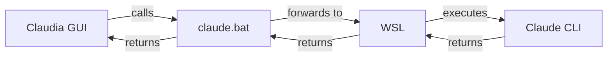

# Claudia on Windows - Community Fix v4.2

A comprehensive guide to run Claudia GUI on Windows using WSL (Windows Subsystem for Linux) as a compatibility bridge.

## 🎯 Quick Overview

This fix enables Claudia to run on Windows by:
- Installing Claude CLI in WSL where it works natively
- Creating a Windows bridge script (`claude.bat`) that Claudia can communicate with
- Automatically detecting and adapting to different Claude CLI versions
- Providing pre-flight checks to ensure everything is configured correctly
- Handling Windows-specific build issues and icon problems

---

## 📋 Prerequisites

Before starting, ensure you have:

| Component | Description | Installation | Notes |
|-----------|-------------|--------------|-------|
| **Windows 10/11** | With latest updates | Windows Update | |
| **WSL 2** | Windows Subsystem for Linux | `wsl --install` in Admin PowerShell | May already be installed |
| **Ubuntu** | Linux distribution for WSL | Microsoft Store | Default WSL distro |
| **Node.js 18+** | Required in WSL for Claude Code | Install via NodeSource in WSL | NOT Windows Node.js |
| **Bun** | JavaScript runtime (Windows) | [bun.sh](https://bun.sh/) | Install in Windows, not WSL |
| **Rust** | For building Tauri | [rustup.rs](https://rustup.rs/) | Install in Windows |
| **VS Build Tools** | C++ compiler | [Download](https://visualstudio.microsoft.com/visual-cpp-build-tools/) | Select "Desktop development with C++" |
| **Claudia** | The app source code | Clone from GitHub | |
| **RAM** | Minimum 4GB recommended | System requirement | |

---

## 🚀 Quick Start (For Experienced Users)

1. Download all files from this gist to your Claudia folder (.gist_v4.2)
2. Run `5-auto-install-windows.bat` to automatically apply all patches
3. Run `3-setup-windows.bat` (installs Claude CLI in WSL and creates bridge)
4. Run `bun install` and `bun run build` **in Windows CMD/PowerShell**
5. Build with `bun run tauri build` **in Windows CMD/PowerShell**
6. Launch with `4-start-claudia.bat`

**Note:** The auto-installer applies all patches automatically!

---

## 📖 Detailed Installation Guide

### Step 0: Pre-Installation Checks

1. **Check if components are already installed:**
   ```cmd
   # In Windows CMD/PowerShell:
   wsl --status
   bun --version
   rustc --version
   
   # In WSL:
   wsl bash -lc "claude --version"
   ```

2. **If Claude Code is already installed in WSL**, skip to Step 3.

### Step 1: Install WSL and Ubuntu

1. **Open PowerShell as Administrator**
   ```powershell
   # Install WSL with Ubuntu
   wsl --install
   ```

2. **Restart your computer**

3. **Set up Ubuntu**
   - Ubuntu will open after restart
   - Create username and password
   - Keep these credentials safe

### Step 2: Install Node.js and Claude Code in WSL

> ⚠️ **Important:** Claude Code does NOT run directly on Windows. It must be installed inside WSL.
> ⚠️ **Critical:** Make sure you're using WSL Node.js, NOT Windows Node.js!

1. **Open Ubuntu/WSL Terminal**

2. **Install Node.js 18+ via NodeSource** (Recommended)
   ```bash
   # Update package list
   sudo apt update
   
   # Install curl if not present
   sudo apt install -y curl
   
   # Add NodeSource repository for Node.js 20.x
   curl -fsSL https://deb.nodesource.com/setup_20.x | sudo -E bash -
   
   # Install Node.js
   sudo apt install -y nodejs
   
   # Verify installation (should show v20.x or higher)
   node --version
   npm --version
   ```

3. **Configure npm for Linux** (Important for WSL)
   ```bash
   # Ensure npm uses Linux paths, not Windows
   npm config set prefix ~/.npm-global
   npm config set os linux
   
   # Add npm global bin to PATH
   echo 'export PATH="$HOME/.npm-global/bin:$PATH"' >> ~/.bashrc
   source ~/.bashrc
   ```

4. **Install Claude Code**
   ```bash
   # Install Claude Code globally (do NOT use sudo)
   npm install -g @anthropic-ai/claude-code
   
   # If you encounter platform detection errors, use:
   npm install -g @anthropic-ai/claude-code --force --no-os-check
   
   # Verify installation
   claude --version
   ```

5. **Troubleshooting Node/npm in WSL**
   
   If `which npm` shows `/mnt/c/...` (Windows path), you're using Windows npm:
   ```bash
   # Check if using Windows npm/node
   which npm
   which node
   
   # If pointing to /mnt/c/, remove Windows paths from WSL
   # Edit ~/.bashrc and remove any Windows PATH additions
   nano ~/.bashrc
   # Remove lines that add /mnt/c/... to PATH
   ```

### Step 3: Install Required Software on Windows

1. **Install Bun** (in Windows, NOT WSL)
   - Visit [https://bun.sh/](https://bun.sh/)
   - Run the PowerShell command (NOT as admin)
   - Verify: `bun --version`

2. **Install Rust** (in Windows, NOT WSL)
   - Visit [https://rustup.rs/](https://rustup.rs/)
   - Run the installer
   - Verify: `rustc --version`

3. **Install Visual Studio Build Tools**
   - Download from [Microsoft](https://visualstudio.microsoft.com/visual-cpp-build-tools/)
   - Select "Desktop development with C++"
   - Install and restart if needed

### Step 4: Clone Claudia and Prepare Files

1. **Clone Claudia** (if not already done)
   ```cmd
   git clone https://github.com/getAsterisk/claudia.git
   cd claudia
   ```

2. **Create .gist_v4.2 folder and download fix files**
   ```cmd
   mkdir .gist_v4.2
   ```
   - Save all files from this gist into `.gist_v4.2` folder:
     - `1-claudia-windows-fix.md` (this file)
     - `2-claude_binary_patch.rs`
     - `3-setup-windows.bat`
     - `4-start-claudia.bat`
     - `5-auto-install-windows.bat` (NEW - automatic installer)
     - `README.md`

### Step 5: Execute Setup with Auto-Installer

> ⚠️ **Important:** The auto-installer must be run BEFORE the setup script!
> 💡 **Why?** It applies all necessary patches to ensure Windows compatibility.

#### Step 5.1: Run the Auto-Installer (NEW in v4.2)

1. **Navigate to your Claudia root directory and run:**
   ```cmd
   .gist_v4.2\5-auto-install-windows.bat
   ```

2. **This automatically:**
   - ✅ Patches main.rs for version compatibility
   - ✅ Fixes agents.rs to suppress "Projects directory not found" errors
   - ✅ Updates fetch-and-build.js for Windows (robocopy support)
   - ✅ Fixes build-executables.js (adds shell support)
   - ✅ Adds icon.ico to tauri.conf.json
   - ✅ Handles robocopy exit codes properly

3. **The script will ask:** "Do you want to run 3-setup-windows.bat now?"
   - Type `y` to continue with setup
   - Type `n` to run it manually later

#### Step 5.2: Run Setup Script (If not done automatically)

1. **Navigate to .gist_v4.2 folder and run:**
   ```cmd
   3-setup-windows.bat
   ```
   
2. **This will:**
   - ✅ Create the Windows bridge script (`claude.bat`)
   - ✅ Set up required directories
   - ✅ Configure PATH variables
   - ✅ Install/update Claude Code in WSL (if needed)
   
3. **Important Note:** The default path to npm must be followed.
   ```
   C:\Users\USERNAME\AppData\Roaming\npm\claude.bat
   ```
   If Claude Code is already installed, some errors are normal

#### Step 5.3: Place Start Script

1. **Place the start script in main Claudia directory:**
   ```cmd
   copy .gist_v4.2\4-start-claudia.bat start-claudia.bat
   ```
   
2. **Important:** The script must be in the root Claudia folder, not in .gist_v4.2

### Step 6: Handle Icon Issues

If you encounter icon format errors:

1. **Create an icons backup folder:**
   ```cmd
   mkdir C:\Development\icons
   ```

2. **Copy working icons** (if provided) to `src-tauri/icons/`

3. **Common icon error:**
   - Error: `resource file icon.ico is not in 3.00 format`
   - Solution: Use properly formatted .ico files or icon generation tools

### Step 7: Build Claudia

> ⚠️ **CRITICAL:** All build commands MUST be run in Windows CMD/PowerShell, NOT in WSL!

1. **Install dependencies** (in Windows CMD)
   ```cmd
   bun install
   ```

2. **Build frontend** (in Windows CMD)
   ```cmd
   bun run build
   ```

3. **Build Tauri app** (in Windows CMD)
   ```cmd
   bun run tauri build
   ```

### Step 8: Launch Claudia

1. **Ensure start-claudia.bat is in the main Claudia folder**
   - The file must be copied from `.gist_v4.2\4-start-claudia.bat` to the root directory
   - Final location: `C:\path\to\claudia\start-claudia.bat` (NOT in .gist_v4.2)

2. **Always use** `start-claudia.bat` to launch (not `4-start-claudia.bat`)
   - Double-click the file or run from CMD
   - This script performs pre-flight checks
   - If any check fails, follow the on-screen instructions

---

## 🔧 How It Works



**Key Components:**

1. **Claude CLI** - Runs natively in WSL/Linux environment
2. **claude.bat** - Windows bridge script that:
   - Detects Claude CLI version automatically
   - Filters incompatible Windows arguments
   - Handles proper command escaping
3. **Patched main.rs** - Accepts multiple Claude versions
4. **start-claudia.bat** - Pre-flight checker and launcher

---

## 🐛 Troubleshooting

### Common Issues and Solutions

| Error | Cause | Solution |
|-------|-------|----------|
| `claude: command not found` | CLI not installed in WSL | Run `2-setup-windows.bat` again |
| `claude.bat is not recognized` | PATH not configured | Add `C:\Users\USERNAME\AppData\Roaming\npm` to system PATH |
| `Failed to load settings` | Missing ~/.claude directory | Run setup script or `wsl mkdir -p ~/.claude` |
| `Version mismatch` | Old patch version | Ensure you applied v4.2 patch |
| `Wrong WSL distribution` | Multiple WSL installs | Edit claude.bat, set `WSL_DISTRO=Ubuntu` |
| `icon.ico not in 3.00 format` | Invalid icon format | Use provided icons or regenerate |
| `cp command not found` | Unix commands in Windows | Apply build script patches |
| `ENOENT: spawn bun` | Missing shell option | Apply build-executables.js patch |
| `Couldn't find a .ico icon` | Missing icon in config | Add icon.ico to tauri.conf.json |
| `pkg-config not found` | Building in WSL instead of Windows | Build in Windows CMD, not WSL |
| `Projects directory not found` | Missing ~/.claude/projects folder | Run `wsl mkdir -p ~/.claude/projects` (non-critical, agents still work). Fixed in v4.2 by changing error to debug log |

### Build Location Issues

**NEVER run build commands in WSL!** Common mistakes:
- ❌ Running `cargo build` in WSL terminal
- ❌ Running `bun run build` in WSL terminal
- ✅ Always use Windows CMD or PowerShell
- ✅ The start-claudia.bat script runs in the correct environment

### Verify Installation

Run these commands to verify your setup:

```cmd
# Check WSL
wsl --status

# Check Claude in WSL
wsl bash -lc "~/.npm-global/bin/claude --version"

# Check bridge
claude --version

# Check Bun
bun --version

# Check Rust
rustc --version
```

### Manual PATH Configuration

If `claude.bat` is not found:

1. Press `Win + X` → System → Advanced system settings
2. Click "Environment Variables"
3. Under "User variables", select "Path" and click "Edit"
4. Add new entry: `C:\Users\USERNAME\AppData\Roaming\npm` (replace USERNAME with your actual username)
5. Click OK and restart Command Prompt

---

## 🆕 What's New in v4.2

| Feature | v4.1 | v4.2 |
|---------|------|------|
| Build Script Patches | Manual application | Fully automated with 5-auto-install-windows.bat |
| Icon Handling | Basic | Comprehensive troubleshooting |
| Build Location | Unclear | Explicit Windows CMD requirement |
| Error Documentation | Basic | Extensive with solutions |
| Pre-installation Checks | None | Check existing installations |
| Script Modifications | Main.rs only | All patches automated |

### Key Improvements:
- Added Windows-specific build script patches
- Clear warnings about build location (Windows vs WSL)
- Comprehensive icon error handling
- Robocopy exit code handling
- Shell spawn fixes for Windows
- Better error messages and solutions

---

## 📝 Notes

- **Development Mode**: The start script runs Claudia in dev mode by default
- **Production Build**: For production, use `bun run tauri build` instead
- **Updates**: When updating Claudia, you may need to reapply patches
- **Multiple WSL**: If you have multiple distributions, edit claude.bat to specify which one
- **Build Environment**: ALWAYS build in Windows CMD/PowerShell, NEVER in WSL

---

## 🤝 Contributing

Found an issue or improvement? Please contribute:
1. Test the fix thoroughly
2. Document any new issues
3. Share your improvements with the community

---

## 📜 Credits

This fix was developed collaboratively by the Claudia community. Special thanks to all testers and contributors who helped refine this solution for Windows users.

**Version:** 4.2  
**Last Updated:** January 2025  
**Compatibility:** Windows 10/11, WSL2, Claudia 0.1.0+
**Major Contributors:** Community testers who identified build script issues, icon problems, and WSL/Windows confusion